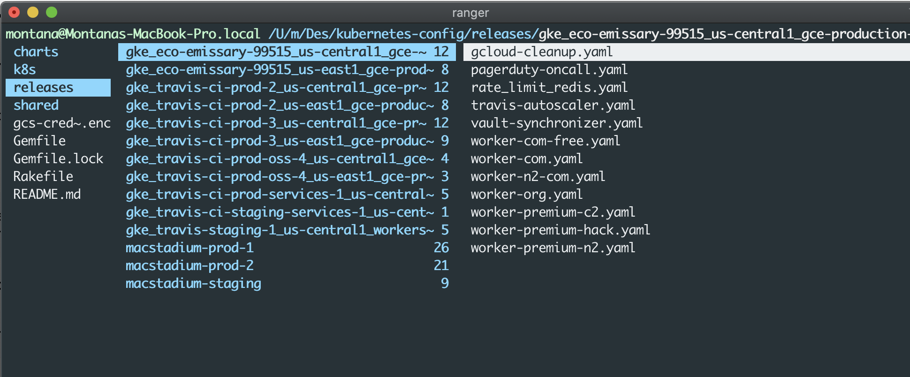
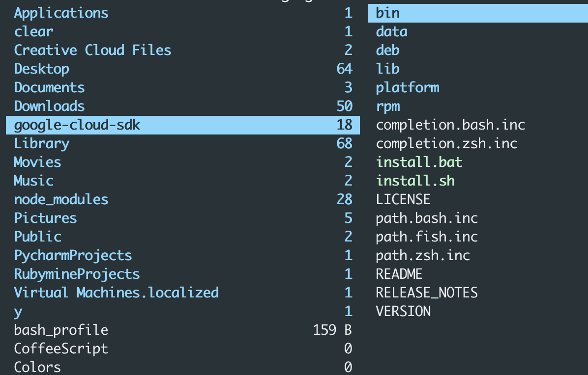
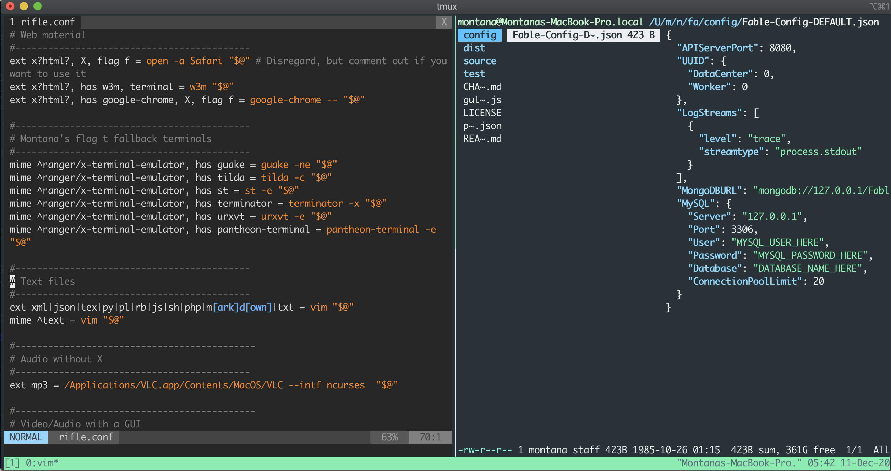
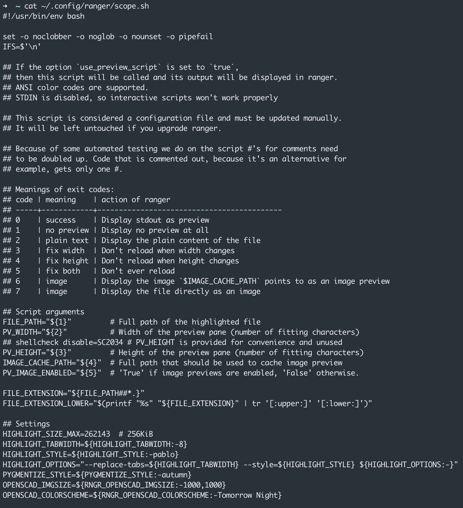

# Montana's rifle.conf 

My customized/personal rifle.conf (customized for macOS) for [ranger](https://github.com/ranger/ranger). Ranger is a console file manager with `VI` key bindings. To grab it, you'll just want to clone it: 

```bash
git clone https://www.github.com/Montana/rifle.conf
```

## Ranger installation on macOS 

You need some prerequisites before you can successfully install `ranger`. Grab `homebrew` via the following: 

```bash
ruby -e "$(curl -fsSL https://raw.githubusercontent.com/Homebrew/install/master/install)" < /dev/null 2> /dev/null
```

Then run: 

```bash
brew install ranger
ranger --copy-config=all
```
You can also install `ranger` via `pip`: 

```bash
pip install ranger-fm --user
``` 

## Getting started with Ranger

You can now open `ranger` by simply running `ranger` in the terminal like so: 

```bash
ranger
```

## Getting started 

To use my [`rifle.conf`](https://github.com/Montana/rifle.conf/blob/main/rifle.conf) you can start by cloning it via: `git clone https://www.github.com/Montana/rifle.conf`. Once you've cloned it, open the `rifle.conf` with your editor of choice, in this markdown though I'll be using Vim. 

```bash
vim ~/.config/ranger/rifle.conf
```

The `rifle.conf` is structured as so, each line provides a set of conditions separated by commas (`,`) e.g. `ext mp3`, followed by an equals `=`, then a terminal command, e.g. vlc `$@`. When Ranger is asked to open a file, it cycles through every line from top to bottom until it finds a line where all the conditions are met, you can logically think of this like `grep`, Ranger then, runs the terminal command. This means that the top-most line where all the conditions are met will be run. Using this logic you can construct a `rifle.conf` that works on different systems, (e.g. Linux, macOS), that is, if you order potential applications from most to least preferred.


> When `ranger` first is called

## Using `commands`

Most if not all Linux applications can simply be opened by typing their name into the terminal, optionally followed by a file to open and various rules, flags, and conditionals, e.g. `zathura example.pdf`. In macOS however, typing the equivalent `preview example.pdf` just returns an error that preview has not been found. The same goes for `Preview`, `preview.app` and `Preview.app`.

Instead, on macOS, the best way I found to call an application from the command line (specifically as it pertains to ranger) is to use `open`.

The following lines all open `Preview.app`:

```bash
open -a preview
open -a preview.app
open -a Preview
open -a Preview.app
```


> Using `open` efficiently

So let's say I had a `pdf` named `Montana.pdf`, just add it:

```bash
open -a Montana.pdf
```
This same syntax can be applied to `rifle.conf` to open specific apps for specific file types with Ranger. The simplest condition to use is the file extension (`ext`). So the following conditional would work: 

```bash
ext pdf = open -a preview "$@"
``` 

## Calling `finder` 

For my `rifle.conf` when adding this keybinding to `~/.config/ranger/rc.conf`, this will allow you to open Finder on the highlighted file with %:

```bash
map % shell open -R %f
```

## Structure hierarchy

Try and split up your `rifle.conf`. You'll see I did this, it will help for you not to get mixed up. Here's a quick example using `Text files`: 

```bash
#-------------------------------------------
# Text files
#-------------------------------------------
ext xml|json|tex|py|pl|rb|js|sh|php|m[ark]d[own]|txt = vim "$@"
mime ^text = vim "$@"
```
## Nested directories (directory flattening)

In the following example, I have a moderately nested directory tree entitled `fable-react`. So in turn, I'll use `:flat`, this allows me to browse a directory tree in a linear fashion, the screenshot below is an example, it's a `tmux`, `vim` and `ranger` config: 

 
> tmux, vim, ranger, `fable-react` directory tree

It is worth noting, how your directory tree is flattened is determined with `rifle`.

## Defining commands

You can define your own set of `commands`, for example, add the following entry to ~/.config/ranger/commands.py to empty the trash directory ~/.Trash.

```python
class empty(Command):
    """:empty

    Empties the trash directory ~/.Trash
    """

    def execute(self):
        self.fm.run("rm -rf /home/myname/.Trash/{*,.[^.]*}")
```

You can imagine you could have endless commands and conditionals. My current setup has some custom commands, but to really have the most options I'm currently running `tmux`, `vim` and `ranger` for all my programming projects.

## Hidden files

You can toggle the visibility of hidden files, specifically files that begin with `.`, e.g. `.travis.yml`,  with the following command: `:set show_hidden!`, or alternatively use `:set show_hidden true` to make hidden files visible, remember this is dependent on the `rifle.conf`. 

```bash
rc.conf
set show_hidden true
```


## Multi tab in the same folder using ranger 

You may have noticed there are two shortcuts for opening a new tab in home in my `rifle.conf` (`gn` and `Ctrl+n`). Let us rebind `Ctrl+n`:

```bash
map <c-n>  eval fm.tab_new('%d')
```
## Ranger pdf config (scope.sh)

By default, `ranger` will mostly preview PDF files as text, similar to that of a `docx`. However, you can `preview` PDF files as an image in `ranger` by first converting the PDF file to an image. Ranger stores the image previews in `~/.cache/ranger/.` You either need to create this directory manually (via `mkdir`) or set `preview_images` to `true` in `~/.config/ranger/rc.conf` to tell `ranger` to call it automatically at `ranger's` next start. However, note that `preview_images`. Note this does not need to be set to `true` the whole time to preview PDF file as images, only `~/.cache/ranger` directory is needed.

_NB_: Try not to push to a `dirty tree` if you can help it, this could add `rifle.conf` problems, that you don't want, and cause you to have to `git reflog`, or `pop` your current `stash`. 

To enable this feature, uncomment the appropriate lines in `/usr/share/doc/ranger/config/scope.sh`, or add/uncomment these lines in your local file `~/.config/ranger/scope.sh`. You also want to make sure the proper permissions are set via `chmod u+x`. 

You can do a cursory check on `scope.sh` via running: 

```bash
cat ~/.config/ranger/scope.sh
```


You can either `cat` scope.sh, or `vim` scope.sh. I prefer just to run `cat` or `gedit`. 

### Authors 
Montana Mendy - [Montana](https://github.com/Montana)
